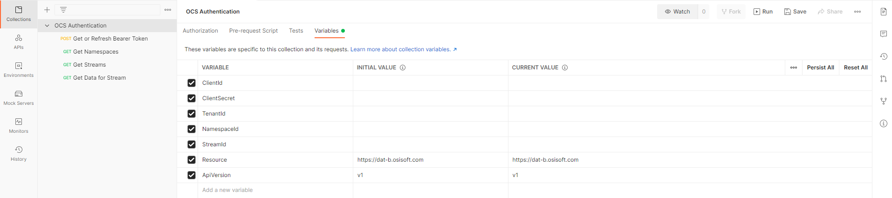

# AVEVA Data Hub Client Authentication Postman Collection

**Version:** 1.0.0

| :loudspeaker: **Notice**: Samples have been updated to reflect that they work on AVEVA Data Hub. The samples also work on OSIsoft Cloud Services unless otherwise noted. |
| -----------------------------------------------------------------------------------------------|  

[](https://dev.azure.com/osieng/engineering/_build/latest?definitionId=4521&branchName=main)

## Requirements

- [Postman](https://www.postman.com/downloads/) version 8.0 or later.
- Register a [Client-Credentials Client](https://datahub.connect.aveva/clients) in your AVEVA Data Hub tenant and create a client secret to use in the configuration of this sample. ([Video Walkthrough](https://www.youtube.com/watch?v=JPWy0ZX9niU))
- Optional: access to a Tenant Id, Namespace Id, and Stream Id 

## About this sample collection

This sample is meant to be a simple introduction to show how you can use Postman to retrieve a bearer token for authenticating against ADH.

## Configuring the sample

Steps:
1. Clone the GitHub repository
1. Open Postman
1. Import the [postman_collection.json](postman_collection.json) file to Postman by selecting Collections in the left sidebar and clicking 'Import'. Import the collection as version 2.1 as recommended.
1. Edit the imported collection by clicking its title, then under the 'Variables' tab add your client Id and secret to the corresponding variable under the 'Current Value' column. 
1. Save the collection using 'ctrl-s' or by clicking the disk icon. 
1. Optionally, to test some interactions with the ADH APIs, add your Tenant Id, Namespace Id, and Stream Id to the corresponding variables. This will let you use the authentication token that we retrieve to make requests to ADH.

Note: Make sure to always save the collection if you make any changes to the variables.



For more information on collection variables, see the [Postman docs](https://learning.postman.com/docs/sending-requests/variables/#defining-collection-variables)

AVEVA Data Hub is secured by obtaining tokens from its token endpoint. Client credential clients provide an identifier and an associated secret that are authenticated against this endpoint which we can see in the 'Get or Refresh Bearer Token' request. 

(This token endpoint is obtained automatically behind the scenes, but if you are interested in how, you can see it being obtained in the 'Pre-request Script' of the 'Get or Refresh Bearer Token' request)

## Running the sample

To run this collection complete the following steps

1. Execute the 'Get or Refresh Bearer Token' request to retrieve an authorization token. 
1. See the token returned in the response under the 'access_token' key. This value can now be used to authenticate your requests. A collection variable called 'token' containing this value has also been created.

To use the token in your requests, either copy the value and paste it as the 'Token' under the 'Auth' section of the request, using the 'Bearer Token' authentication type, or simply use the 'token' variable created for you. Take a look at the 'Get Namespaces' request for example.


We have created this variable by adding a Javascript test under the 'Tests' section of the 'Get or Refresh Bearer Token' request that will store the token value every time you execute the request. This is to make refreshing the token simpler, but if desired you can also copy-paste the 'access_token' value from the 'Get or Refresh Bearer Token' response to use as the 'Token' for your requests. 

### Refreshing the Token
The token has an expiration time after which it expires that is returned under the 'expires_in' key in the response. You should see this set to 3600 in the response, meaning 3600 seconds (1 hour). This expiration time is configurable by editing your client credentials client in the portal.

Once the token has expired, execute the 'Get or Refresh Bearer Token' request to see the new value reflected in the 'token' variable or to copy the new 'access_token' to use in your requests.

### Sample ADH requests

If you entered Tenant, Namespace, and Stream identifiers mentioned in the 'Configuring the Sample' section above, execute the remaining 'Get Tenant Info', 'Get Namespaces', 'Get Streams', and 'Get Data for Stream' requests to see some ADH API use cases. 

**Note**: To make the 'Get Data for Stream' request you will need to replace the placeholders for start index and count under the Params columns. It is also required that the client you are using has the required permissions to read data for the stream, for more information see the video walkthrough of creating a client ([Video Walkthrough](https://www.youtube.com/watch?v=JPWy0ZX9niU)).


## Testing the sample

To test this sample run
```bash
npm ci
```
to install dependencies, then run
```bash
npm install -g newman
```
to install newman

Then replace the placeholders in [appsettings.placeholder.json](appsettings.placeholder.json) with your values and rename the file to appsettings.json. (The file name appsettings.json is ignored by Git to avoid users accidentally exposing sensitive data) 

Then run
```bash
newman run ./postman_collection.json -d ./appsettings.json
```

---

Tested against Postman v9.9.3
For the main ADH Authentication samples page [ReadMe](https://github.com/osisoft/OSI-Samples-OCS/blob/main/docs/AUTHENTICATION.md)  
For the main ADH samples page [ReadMe](https://github.com/osisoft/OSI-Samples-OCS)  
For the main AVEVA samples page [ReadMe](https://github.com/osisoft/OSI-Samples)
